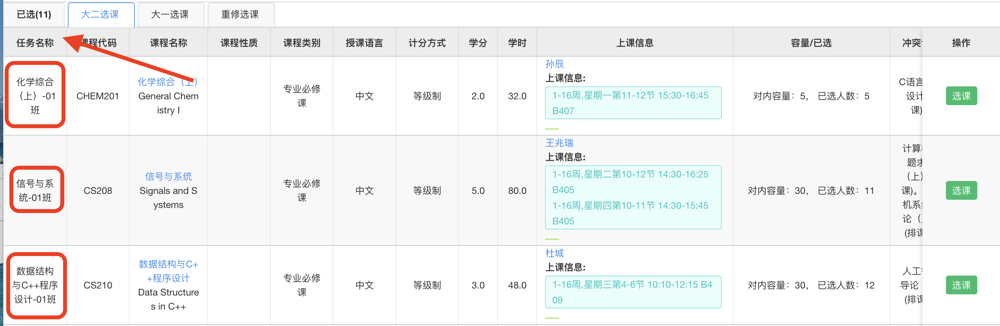
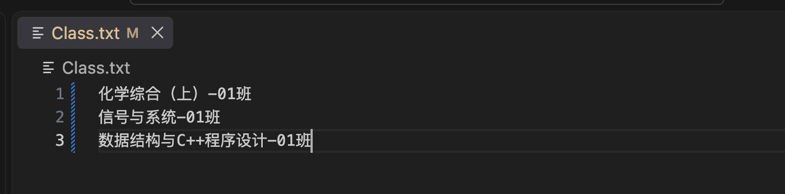
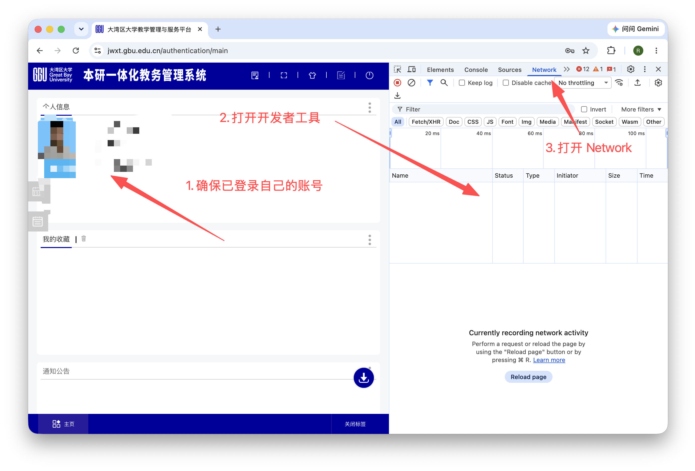
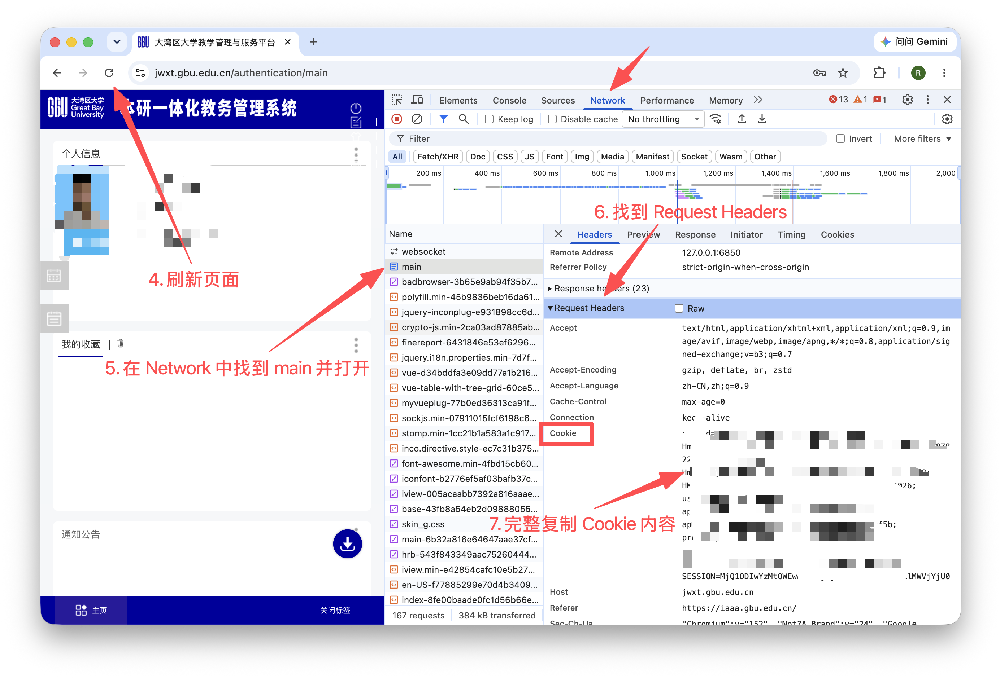

# 湾大教务系统选课助手

这是一个面向**大湾区大学（Great Bay University）教务系统**的命令行选课助手。它读取 `Class.txt` 中的课程优先级，查询当前学期的课程任务，并按文件顺序提交“先到先得”课程。

- 登录由用户在 GBU 统一认证门户手动完成，程序不要求学号或密码。
- 程序从本地 `Cookie.txt` 读取当前会话 Cookie；**请勿上传真实 Cookie 到 GitHub**。
- 不使用并发高频请求；每次只会按顺序发送一门课程请求，每门课程最多尝试 3 次，间隔 1 秒。
- 经测试，本版本于 2026-09-04 在 Python 3.10 环境下可正常选课。

## 使用说明

### 0. 安装

需要 Python 3.10 或更高版本：

```bash
git clone https://github.com/Siruuui/GBU-TIS-Tools.git
cd GBU-TIS-Tools/
python -m pip install -r requirements.txt
```

### 1. 配置课程

开始选课前，登录教务系统，复制相应课程的“任务名称“，粘贴到根目录的 `Class.txt`，每行一门课程，顺序就是优先级。

课程列表添加说明（图片加载不出请科学加载）： 
  
  

* 填写完整任务名称最可靠。
* 填写课程名也可以执行，但必须保证系统中必须只有一个同名班级。

### 2. 配置 Cookie（登录）

> 建议在选课开始前再执行，避免 Cookie 过期

1. 打开 <https://jwxt.gbu.edu.cn/>，以下使用 Chrome 浏览器示例。
2. 通过 GBU 统一认证门户完成登录，确认页面已经显示个人信息。
3. 打开开发者工具：macOS 使用 `⌘ + Option + I`，Windows 使用 `Ctrl + Shift + I`。
4. 点击 **Network（网络）**，回到教务系统并刷新页面；也可以进入选课页面后再刷新。
5. 在请求列表中选择域名为 `jwxt.gbu.edu.cn` 或 `main` 的请求。
6. 在右侧打开 **Headers（标头）**，展开 **Request Headers（请求标头）**，找到 `Cookie:`。
7. 复制 `Cookie:` 后面的完整内容，例如：

   ```text
   srv_id=...; SESSION=...; route=...; userNameSSO=...
   ```

   不要复制整段 `Copy as cURL` 内容；只复制 Cookie 值即可。程序也接受带有 `Cookie:` 前缀的粘贴内容。
8. 将复制的 Cookie 粘贴到项目根目录的 `Cookie.txt`，然后运行程序：

Cookie 添加说明（图片加载不出请科学加载）：
 
 

### 3. 执行

#### 手动执行

```bash
python main.py
```

* 程序会读取 `Cookie.txt`，验证登录状态，再读取当前学期、开放选课类别和课程任务。
* 默认情况下，核对待选课程后按回车开始提交；输入其他字符则取消。
* 结果会逐门显示。已选、已满、冲突或选课结束的课程会停止重试。

#### 定时执行

如果希望在指定时间自动开始，提前完成登录、写好 Cookie 后运行：

```bash
python main.py --start-at "2026-09-05 20:00:00" # 开始时间
```

* 脚本会在本地等待，不会在等待期间反复请求教务系统；到指定的本机时间才开始提交。

## 声明

本项目的主要目的，是通过抽象人对计算机的操作并将步骤，帮助用户整理课程并提交本人账号的选课请求，**从而尽量降低选课过程产生的请求量、减轻选课系统负担**；这一效果已经过南科大同学实际测试验证。

- 脚本不会攻击教务系统，不进行漏洞利用、认证绕过、密码爆破、批量账号操作或其他未经授权的行为。
- 脚本不会代替用户完成统一认证；它只复用用户本人已经登录后提供的会话，并调用教务系统公开页面正常使用的查询和选课接口。
- 脚本不保证选课成功、服务持续可用或数据始终准确。教务系统的规则、接口和服务状态可能随时变化。
- 用户必须遵守学校规定、相关法律法规和教务系统的使用条款，合理控制请求频率，不得通过修改脚本制造异常流量或影响系统正常运行。
- Cookie 等会话凭证具有登录权限。用户应妥善保管，不得发送给他人或提交到代码仓库；因凭证泄露、脚本修改或不当使用造成的后果由用户自行承担。
- 本项目按 MIT License 发布。除许可证明确规定的内容外，作者和贡献者不提供任何明示或默示保证，也不对因使用本项目造成的直接或间接损失承担责任。

## 🙏致谢

感谢南方科技大学同学作出的开源贡献：

[南科大Tis选课助手v6.0.0](https://github.com/Baojun-Gao/SUSTech_Tools-6.0.0)

[南科大Tis选课助手v5.0.0](https://github.com/GhostFrankWu/SUSTech_Tools)
